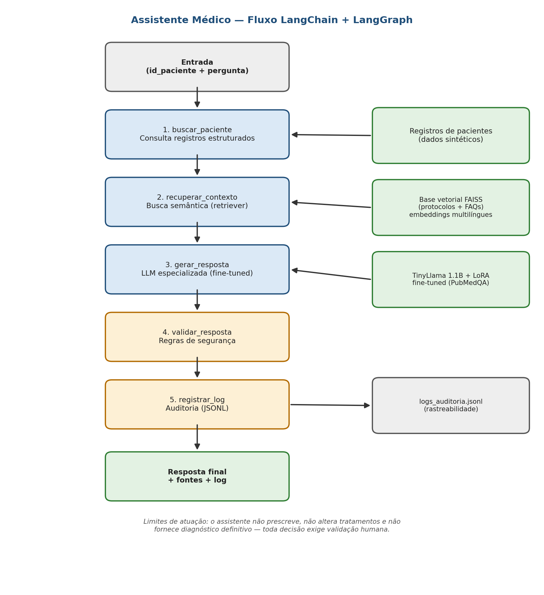

# Tech-Challenge-03-2026

## Assistente Médico com LLM Especializada, LangChain e LangGraph

## Link do vídeo de demonstração

<!-- ATUALIZAR: substituir pelo link do vídeo após a gravação -->
<a href="https://youtu.be/B2-zlPZBlBo">Vídeo</a> ou link: COLAR_LINK_AQUI

## Relatório técnico

O relatório técnico completo, com a metodologia, os resultados e a análise crítica, está em **[`docs/relatorio_tecnico.md`](docs/relatorio_tecnico.md)**.

---

Projeto desenvolvido para o Tech Challenge da Fase 3 da Pós-Tech (FIAP). O objetivo é construir um assistente virtual médico treinado com dados próprios do hospital, capaz de auxiliar em condutas clínicas, responder dúvidas de médicos e sugerir procedimentos com base em protocolos internos — com fluxos de decisão automatizados e seguros, coordenados com LangChain e LangGraph.

> **Aviso:** este é um projeto acadêmico. O assistente não prescreve medicamentos, não realiza diagnósticos definitivos e não substitui avaliação médica. Todos os dados de pacientes são **sintéticos**.

---

## O que o projeto entrega

| Requisito do desafio | Onde está |
|---|---|
| Fine-tuning de LLM com dados médicos | `src/fine_tuning/` e notebook (seções 6–10) |
| ↳ protocolos, FAQs e modelos de laudos/receitas/procedimentos no treino | `src/dados/corpus_hospitalar.py` e notebook (seção 6.5) |
| Preprocessing, anonimização e curadoria | `src/dados/pubmedqa.py` e notebook (seções 4–5); dados hospitalares 100% sintéticos |
| Assistente com LangChain (RAG + base estruturada) | `src/rag/` e `src/assistente/` e notebook (seções 13–14) |
| Fluxo orquestrado com LangGraph | `src/assistente/grafo.py` e notebook (seção 15) |
| Segurança e limites de atuação | `src/assistente/seguranca.py` e notebook (seção 15.5) |
| Logging para auditoria | `src/assistente/auditoria.py` e notebook (seção 15.6) |
| Explainability (fontes das respostas) | metadados dos documentos recuperados, exibidos em cada resposta |
| Dataset sintético | `data/dados_hospitalares_sinteticos.json` |
| Relatório técnico + diagrama | `docs/relatorio_tecnico.md` e `docs/diagrama_fluxo.png` |
| Avaliação do modelo (antes/depois) | `src/fine_tuning/avaliacao.py` e notebook (seções 11 e 19) |

---

## Estrutura do repositório

```
tech-challenge-fase3/
├── README.md                     # este arquivo
├── requirements.txt              # dependências do projeto
├── notebooks/
│   └── tech_challenge_fase3.ipynb   # desenvolvimento completo e documentado
├── src/                          # projeto modularizado em Python
│   ├── config.py                 # parâmetros centrais (modelo, LoRA, RAG, geração)
│   ├── main.py                   # demo CLI do assistente completo
│   ├── dados/
│   │   ├── pubmedqa.py           # carga, curadoria e preparação do PubMedQA
│   │   ├── hospital.py           # dados hospitalares sintéticos + consulta de pacientes
│   │   ├── corpus_hospitalar.py  # exemplos de fine-tuning a partir dos dados do hospital
│   │   └── preparacao.py         # combinação PubMedQA + corpus hospitalar
│   ├── fine_tuning/
│   │   ├── treinamento.py        # pipeline de fine-tuning (Unsloth + LoRA)
│   │   └── avaliacao.py          # métricas e comparação base vs. fine-tuned
│   ├── rag/
│   │   └── base_conhecimento.py  # Documents, chunks, embeddings, FAISS, retriever
│   └── assistente/
│       ├── estado.py             # estado compartilhado do LangGraph
│       ├── nos.py                # nós do fluxo
│       ├── grafo.py              # montagem e compilação do grafo
│       ├── llm.py                # geração de respostas com o modelo especializado
│       ├── seguranca.py          # validação e limites de atuação
│       └── auditoria.py          # logging JSONL para auditoria
├── data/
│   └── dados_hospitalares_sinteticos.json  # protocolos, FAQs, modelos, pacientes fictícios
├── docs/
│   ├── relatorio_tecnico.md      # relatório técnico detalhado
│   ├── diagrama_fluxo.png        # diagrama do fluxo LangChain/LangGraph
│   ├── diagrama_fluxo.mmd        # fonte Mermaid do diagrama
│   └── roteiro_video.md          # roteiro sugerido do vídeo de demonstração
└── logs/
    └── exemplo_logs_auditoria.jsonl  # exemplo real de log gerado pelo assistente
```

---

## Como executar

### Opção 1 — Notebook (recomendada)

O caminho mais simples é abrir `notebooks/tech_challenge_fase3.ipynb` no **Google Colab** com runtime de **GPU (T4)** e executar as células em ordem. O notebook realiza todo o processo: download do PubMedQA, curadoria, fine-tuning, avaliação, construção do RAG, montagem do fluxo LangGraph e testes do assistente.

### Opção 2 — Projeto modularizado

Requisitos: Python 3.10+, GPU com CUDA (para fine-tuning e inferência do modelo em 4 bits).

1. **Instalar dependências:**

```bash
pip install -r requirements.txt
```

2. **Baixar o dataset PubMedQA** (na raiz do projeto):

```bash
git clone https://github.com/pubmedqa/pubmedqa.git
```

3. **Executar o fine-tuning:**

```python
from src.dados.preparacao import composicao, montar_dataset_treinamento
from src.fine_tuning.treinamento import executar_fine_tuning

# combina o PubMedQA com o corpus hospitalar (protocolos, FAQs e modelos)
treino, teste = montar_dataset_treinamento()
print(composicao(treino))

modelo, tokenizer, resultado = executar_fine_tuning(treino)
```

O modelo especializado é salvo em `tinyllama-pubmedqa-lora/`.

4. **Avaliar (comparação base vs. fine-tuned):**

```python
from unsloth import FastLanguageModel
from src.fine_tuning.treinamento import carregar_modelo_base
from src.fine_tuning.avaliacao import avaliar_modelo, calcular_metricas, imprimir_comparacao

# Modelo fine-tuned
FastLanguageModel.for_inference(modelo)
resultados_ft = avaliar_modelo(modelo, tokenizer, teste)
metricas_ft, _ = calcular_metricas(resultados_ft)

# Modelo base (baseline)
modelo_base, tokenizer_base = carregar_modelo_base()
FastLanguageModel.for_inference(modelo_base)
resultados_base = avaliar_modelo(modelo_base, tokenizer_base, teste, descricao="Baseline")
metricas_base, _ = calcular_metricas(resultados_base)

imprimir_comparacao(metricas_base, metricas_ft)
```

5. **Executar o assistente completo (fluxo LangGraph):**

```bash
python -m src.main --paciente P001 --pergunta "Quais informações são relevantes para o acompanhamento?"
```

A saída inclui a resposta validada, as **fontes utilizadas** (explainability) e o **log de auditoria**. Os logs são acumulados em `logs/logs_auditoria.jsonl`.

---

## Arquitetura do assistente



O fluxo LangGraph possui 5 nós sequenciais:

1. **buscar_paciente** — consulta os registros estruturados do paciente;
2. **recuperar_contexto** — busca semântica na base vetorial FAISS (protocolos e FAQs do hospital);
3. **gerar_resposta** — a LLM especializada gera a resposta usando dados do paciente + contexto recuperado;
4. **validar_resposta** — regras de segurança detectam recomendações restritas (ex.: prescrição direta) e anexam alerta de validação humana;
5. **registrar_log** — grava o registro completo da execução para auditoria.

Detalhes completos em [`docs/relatorio_tecnico.md`](docs/relatorio_tecnico.md).

---

## Segurança e limites de atuação

- O assistente **nunca prescreve** medicamentos nem altera tratamentos;
- Não fornece **diagnóstico definitivo** — toda decisão clínica exige validação por profissional de saúde;
- As instruções de segurança são aplicadas em **duas camadas**: no prompt do modelo e na validação pós-geração (`src/assistente/seguranca.py`);
- Cada resposta indica as **fontes** dos documentos utilizados;
- Cada execução gera um **log de auditoria** com data/hora, paciente, pergunta, fontes e respostas antes/depois da validação.

## Dados e anonimização

O fine-tuning utiliza **duas fontes**, com instruções distintas para que o modelo condicione o formato da saída à tarefa:

- **PubMedQA (PQA-L)**: 1.000 pares de pergunta/resposta baseados em literatura biomédica pública — sem dados de pacientes. Ensina o raciocínio clínico sobre evidências (`Resposta: yes/no/maybe` + justificativa);
- **Corpus hospitalar sintético**: 17 exemplos curados a partir dos protocolos internos, das perguntas frequentes e dos modelos de laudos, receitas e procedimentos (`src/dados/corpus_hospitalar.py`). Ensina o formato de apoio clínico efetivamente usado pelo assistente, incluindo os limites de atuação e a citação da fonte.

Os exemplos hospitalares são construídos no **mesmo formato que o assistente recebe em produção** (instrução + dados do paciente + contexto recuperado + pergunta), eliminando divergência entre treino e inferência.

Todos os dados hospitalares são **sintéticos**, criados exclusivamente para o projeto. Nenhum dado real de paciente é utilizado, o que garante a anonimização por construção.

## Equipe

Projeto desenvolvido em grupo para a Fase 3 da Pós-Tech (8IADT).
